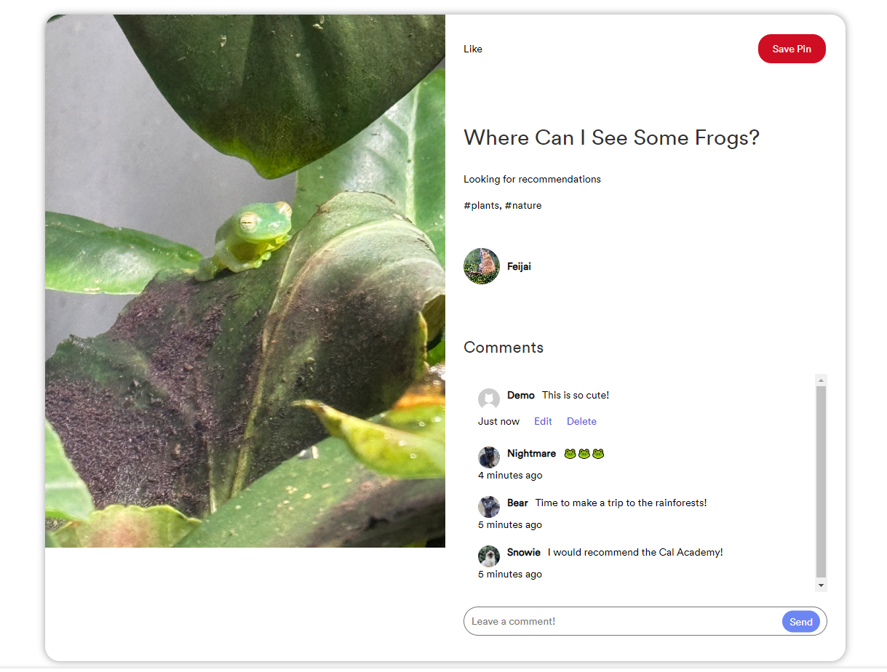
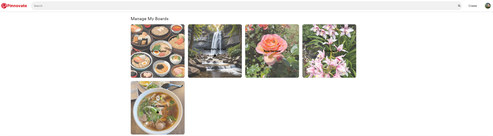

# Pinnovate

Welcome to Pinnovate, a versatile platform for users to discover, save, and organize inspiring content. By allowing users to create and manage personalized boards by saving images and other media, this app aims to help users explore various interests, find new ideas, and stay organized.

### Discover Various Interests

Pinnovate is designed to be a dynamic canvas for exploring a wide range of interests and passions. Users can dive into diverse categories, from animals and nature to technology and DIY projects. The app's intuitive search and discovery features ensure that users can find content that resonates with their unique tastes and hobbies, making it a powerful tool for curiosity and creativity.

### Sharing With Others

In addition to discovering and organizing content, Pinnovate empowers users to share their own creations and content. Whether it is a stunning photo, a helpful article, or a groundbreaking idea, users can post their content directly to the platform, enriching the community with fresh perspectives and insights.

Sharing your own content not only allows you to showcase your interests and ideas but also fosters engagement with other users. This collaborative environment encourages the exchange of ideas and helps build a supportive network around shared passions.

# Live Site Link
https://pinnovate.onrender.com

# Live Site Preview

### Pinnovate Homepage


### Pinnovate Pin Details and Comments


### Pinnovate Manage Your Boards


### Pinnovate Board Pins


## Key Features

- **Backend with Flask and SQLAlchemy**: Implemented robust backend routes using Flask and SQLAlchemy. This setup ensures efficient data handling, secure API endpoints, and seamless interactions between the frontend and the database, providing a solid foundation for the platform's functionality.
- **Dynamic UI powered by React, Redux, and React Router**: Developed a responsive and visually compelling use interface utilizing React, Redux, and React Router.Implemented modern UX/UI principles to create a smooth, intuitive user experience with efficient state management and easy navigation throughout the platform.
- **Full CRUD Functionality for Pins and Comments**: Developed comprehensive CRUD operations for pin management and comments, allowing users to create, read, update, and delete their own pins and comments within the platform.
- **Tag-Based Filtering**: Includes a dynamic filter feature that allows users to search and browse pins by tags, making it easy to discover pins and tags that match their interests.
- **Board Management**: Seamlessly integrated into the user experience, Users can easily add and manage their saved pins through a personalized board feature. This functionality allows users to save pins they are interested in, providing a convenient way to keep track of their favorites and reference them later.
- **File Uploads and Storage with AWS**: Enabled users to upload photos directly from their computers or devices, with secure storage provided by AWS. This ensures reliable and scalable management of user-generated content.

## Technologies Used


## Getting started

1. Clone this repository (only this branch).

2. Install dependencies.

   ```bash
   pipenv install -r requirements.txt
   ```

3. Create a **.env** file based on the example with proper settings for your
   development environment.

4. Make sure the SQLite3 database connection URL is in the **.env** file.

5. This starter organizes all tables inside the `flask_schema` schema, defined
   by the `SCHEMA` environment variable. Replace the value for
   `SCHEMA` with a unique name, **making sure you use the snake_case
   convention.**

6. Get into your pipenv, migrate your database, seed your database, and run your
   Flask app:

   ```bash
   pipenv shell
   ```

   ```bash
   flask db upgrade
   ```

   ```bash
   flask seed all
   ```

   ```bash
   flask run
   ```

7. The React frontend has no styling applied. Copy the **.css** files from your
   Authenticate Me project into the corresponding locations in the
   **react-vite** folder to give your project a unique look.

8. To run the React frontend in development, `cd` into the **react-vite**
   directory and run `npm i` to install dependencies. Next, run `npm run build`
   to create the `dist` folder. The starter has modified the `npm run build`
   command to include the `--watch` flag. This flag will rebuild the **dist**
   folder whenever you change your code, keeping the production version up to
   date.

# API Documentation - Backend API Routes

## USER AUTHENTICATION/AUTHORIZATION

### All endpoints that require authentication

All endpoints that require a current user to be logged in.

- Request: endpoints that require authentication
- Error Response: Require authentication

  - Status Code: 401
  - Headers:
    - Content-Type: application/json
  - Body:

    ```json
    {
      "message": "Authentication required"
    }
    ```

### All endpoints that require proper authorization

All endpoints that require authentication and the current user does not have the
correct role(s) or permission(s).

- Request: endpoints that require proper authorization
- Error Response: Require proper authorization

  - Status Code: 403
  - Headers:
    - Content-Type: application/json
  - Body:

    ```json
    {
      "message": "Forbidden"
    }
    ```

### Get the Current User

Returns the information about the current user that is logged in.

- Require Authentication: false
- Request

  - Method: GET
  - URL: /api/session
  - Body: none

- Successful Response when there is a logged in user

  - Status Code: 200
  - Headers:
    - Content-Type: application/json
  - Body:

    ```json
    {
      "user": {
        "id": 1,
        "username": "JohnSmith",
        "email": "john.smith@gmail.com",
        "first_name": "John",
        "last_name": "Smith",
        "bio": "User bio",
        "profile_image_url": "http://website.com/image.jpg"
      }
    }
    ```

- Successful Response when there is no logged in user

  - Status Code: 200
  - Headers:
    - Content-Type: application/json
  - Body:

    ```json
    {
      "user": null
    }
    ```

### Log In a User

Logs in a current user with valid credentials and returns the current user's
information.

- Require Authentication: false
- Request

  - Method: POST
  - URL: /api/session
  - Headers:
    - Content-Type: application/json
  - Body:

    ```json
    {
      "credential": "john.smith@gmail.com",
      "password": "secret password"
    }
    ```

- Successful Response

  - Status Code: 200
  - Headers:
    - Content-Type: application/json
  - Body:

    ```json
    {
      "user": {
        "id": 1,
        "username": "JohnSmith",
        "email": "john.smith@gmail.com",
        "first_name": "John",
        "last_name": "Smith",
        "bio": "User bio",
        "profile_image_url": "http://website.com/image.jpg",

        // Additional attributes added to to_dict()
        "pin_in_board": [],
        "liked_pins": [],
        "created_tags": []
      }
    }
    ```

- Error Response: Invalid credentials

  - Status Code: 401
  - Headers:
    - Content-Type: application/json
  - Body:

  ```json
  {
    "message": "Invalid credentials"
  }
  ```

- Error response: Body validation errors

  - Status Code: 400
  - Headers:
    - Content-Type: application/json
  - Body:

    ```json
    {
      "message": "Bad Request",
      "errors": {
        "email": ["Email provided not found."],
        "password": ["No such user exists."]
      }
    }
    ```

### Sign Up a User

Creates a new user, logs them in as the current user, and returns the current
user's information.

- Require Authentication: false
- Request

  - Method: POST
  - URL: /api/users
  - Headers:
    - Content-Type: application/json
  - Body:

    ```json
    {
      "id": 1,
      "username": "JohnSmith",
      "email": "john.smith@gmail.com",
      "first_name": "John",
      "last_name": "Smith",
      "bio": "User bio",
      "profile_image_url": "http://website.com/image.jpg"
    }
    ```

- Successful Response

  - Status Code: 200
  - Headers:
    - Content-Type: application/json
  - Body:

    ```json
    {
      "user": {
        "id": 1,
        "username": "JohnSmith",
        "email": "john.smith@gmail.com",
        "first_name": "John",
        "last_name": "Smith",
        "bio": "User bio",
        "profile_image_url": "http://website.com/image.jpg",

        // Additional attributes added to to_dict()
        "pin_in_board": [],
        "liked_pins": [],
        "created_tags": []
      }
    }
    ```

- Error response: User already exists with the specified email

  - Status Code: 500
  - Headers:
    - Content-Type: application/json
  - Body:

    ```json
    {
      "message": "Username is already in use.",
      "errors": {
        "email": "Email address is already in use."
      }
    }
    ```

- Error response: User already exists with the specified username

  - Status Code: 500
  - Headers:
    - Content-Type: application/json
  - Body:

    ```json
    {
      "message": "Username is already in use.",
      "errors": {
        "username": "User with that username already exists"
      }
    }
    ```

- Error response: Body validation errors

  - Status Code: 400
  - Headers:
    - Content-Type: application/json
  - Body:

    ```json
    {
      "message": "Bad Request",
      "errors": {
        "email": "Invalid email",
        "username": "Username is required. Username must be between 2 and 50 characters long.",
        "first_name": "First Name is required. First name must be between 2 and 50 characters long.",
        "last_name": "Last Name is required. Last name must be between 1 and 50 characters long.",
        "bio": "Bio must be between 1 and 255 characters long",
        "profile_picture": "Profile image must be a PNG or JPEG file"
      }
    }
    ```

## Pin Routes

### Get all Pin

Returns all the Pins

- Require Authentication: false
- Request

  - Method: GET
  - URL: /api/pins
  - Body: none

- Successful Response

  - Status Code: 200
  - Headers:
    - Content-Type: application/json
  - Body:

    ```json
    [
      {
        "id": 1,
        "user_id": 1,
        "title": "New Pin",
        "description": "Description for this pin",
        "image_url": "http://website.com/image.jpg",
        "created_at": "Tue, 03 Sep 2024 06:33:30 GMT",
        "updated_at": "Tue, 03 Sep 2024 06:33:30 GMT",

        // additional attributes from the to_dict()
        "comments": [],
        "user_username": "Pin creator username",
        "user_first_name": "Pin creator first name",
        "user_profile_image_url": "http://website.com/image.jpg",
        "tags": [],
        "comments": []
      }
    ]
    ```

### Get details of a Pin from Pin Id

Returns the details of a Pin specified by its id.

- Request

  - Method: GET
  - URL: /api/pins/:pinId
  - Body: none

- Successful Response

  - Status Code: 200
  - Headers:
    - Content-Type: application/json
  - Body:

    ```json
    {
      "id": 1,
      "user_id": 1,
      "title": "New Pin",
      "description": "Description for this pin",
      "image_url": "http://website.com/image.jpg",
      "created_at": "Tue, 03 Sep 2024 06:33:30 GMT",
      "updated_at": "Tue, 03 Sep 2024 06:33:30 GMT",

      // additional attributes from the to_dict()
      "comments": [],
      "user_username": "Pin creator username",
      "user_first_name": "Pin creator first name",
      "user_profile_image_url": "http://website.com/image.jpg",
      "tags": [
        {
          "default": true,
          "description": "Tag description (if provided)",
          "id": 1,
          "name": "Tag name",
          "user_id": null
        }
      ],
      "comments": [
        {
          "id": 1,
          "pin_id": 2,
          "user_id": 1,
          "comment": "Pin comment",
          "created_at": "Tue, 03 Sep 2024 06:33:30 GMT",
          "user": {
            "first_name": "Demo",
            "id": 1,
            "last_name": "User",
            "profile_image_url": "http://website.com/image.jpg",
            "username": "username of user who left the comment"
          }
        }
      ]
    }
    ```

- Error response: Couldn't find a Pin with the specified id

  - Status Code: 404
  - Headers:
    - Content-Type: application/json
  - Body:

    ```json
    {
      "message": "Pin not found"
    }
    ```

### Create an Pin

Creates and returns a new Pin.

- Require Authentication: true
- Request

  - Method: POST
  - URL: /api/pins/new
  - Headers:
    - Content-Type: application/json
  - Body:

    ```json
    {
      "title": "New Pin",
      "description": "Description for new pin",
      "image_url": "http://website.com/image.jpg"
    }
    ```

- Successful Response

  - Status Code: 201
  - Headers:
    - Content-Type: application/json
  - Body:

    ```json
    {
      "id": 1,
      "user_id": 1,
      "title": "New Pin",
      "description": "Description for new pin",
      "image_url": "http://website.com/image.jpg",
      "created_at": "Tue, 03 Sep 2024 06:33:30 GMT",
      "updated_at": "Tue, 03 Sep 2024 06:33:30 GMT"
    }
    ```

- Error Response: Body validation errors

  - Status Code: 400
  - Headers:
    - Content-Type: application/json
  - Body:

    ```json
    {
      "message": "Bad Request",
      "errors": {
        "title": "New Pin",
        "description": "Description for new pin",
        "image_url": "http://website.com/image.jpg"
      }
    }
    ```

### Edit a Pin

Updates and returns an existing pin.

- Require Authentication: true
- Require proper authorization: pin must belong to the current user
- Request

  - Method: PUT
  - URL: /api/pins/:pinId/edit
  - Headers:
    - Content-Type: application/json
  - Body:

    ```json
    {
      "title": "Updated Pin Title",
      "description": "New description for pin",
      "image_url": "http://website.com/image.jpg"
    }
    ```

- Successful Response

  - Status Code: 200
  - Headers:
    - Content-Type: application/json
  - Body:

    ```json
    {
      "id": 1,
      "user_id": 1,
      "title": "Updated Pin Title",
      "description": "New description for pin",
      "image_url": "http://website.com/image.jpg",
      "created_at": "Tue, 03 Sep 2024 03:33:30 GMT",
      "updated_at": "Tue, 03 Sep 2024 06:33:30 GMT"
    }
    ```

- Error Response: Body validation errors

  - Status Code: 400
  - Headers:
    - Content-Type: application/json
  - Body:

    ```json
    {
      "message": "Bad Request",
      "errors": {
        "image_url": "Image is required and must be a PNG or JPEG file",
        "title": "Title must be between 2 and 100 characters.",
        "description": "Description must be between 2 and 255 characters."
      }
    }
    ```

- Error response: Couldn't find an Pin with the specified id

  - Status Code: 404
  - Headers:
    - Content-Type: application/json
  - Body:

    ```json
    {
      "message": "Pin not found"
    }
    ```

### Delete an Pin

Deletes an existing Pin.

- Require Authentication: true
- Require proper authorization: Pin must belong to the current user
- Request

  - Method: DELETE
  - URL: /api/pins/:pinId
  - Body: none

- Successful Response

  - Status Code: 200
  - Headers:
    - Content-Type: application/json
  - Body:

    ```json
    {
      "message": "Pin has been successfully deleted"
    }
    ```

- Error response: Couldn't find an Pin with the specified id

  - Status Code: 404
  - Headers:
    - Content-Type: application/json
  - Body:

    ```json
    {
      "message": "Pin not found"
    }
    ```

## Comments Routes

### Get all Comments of the Current User

Returns all the Comments.

- Require Authentication: true
- Request

  - Method: GET
  - URL: /api/comments/all
  - Body: none

- Successful Response

  - Status Code: 200
  - Headers:
    - Content-Type: application/json
  - Body:

    ```json
    {
      "Commments": [
        {
          "id": 1,
          "user_id": 1,
          "pin_id": 2,
          "comment": "Cool Demo Pin",
          "created_at": "Tue, 03 Sep 2024 06:33:30 GMT",

          // Addition attributes
          "user": {
            "id": 1,
            "username": "Demo",
            "first_name": "Demo",
            "last_name": "User",
            "profile_image_url": "http://website.com/image.jpg"
          }
        }
      ]
    }
    ```

### Get all Comments by a Pin's id

Returns all the Comments that belong to an Pin specified by id.

- Require Authentication: false
- Request

  - Method: GET
  - URL: /api/comments/:pinId
  - Body: none

- Successful Response

  - Status Code: 200
  - Headers:
    - Content-Type: application/json
  - Body:

  ```json
  {
    "Comments": [
      {
        "id": 2,
        "user_id": 2,
        "pin_id": 4,
        "comment": "Comment",
        "created_at": "Tue, 03 Sep 2024 06:33:30 GMT",
        "user": {
          "id": 2,
          "username": "Commenter username",
          "first_name": "Commenter first name",
          "last_name": "Commenter last name",
          "profile_image_url": "http://website.com/image.jpg"
        }
      }
    ]
  }
  ```

- Error response: Couldn't find a Pin with the specified id

  - Status Code: 404
  - Headers:
    - Content-Type: application/json
  - Body:

    ```json
    {
      "message": "Pin not found"
    }
    ```

### Create a Comment for an Pin based on the Pin's id

Create and return a new Comment for a Pin specified by id.

- Require Authentication: true
- Request

  - Method: POST
  - URL: /api/comments/pin/:pinId
  - Headers:
    - Content-Type: application/json
  - Body:

    ```json
    {
      "comment": "New comment on existing pin"
    }
    ```

- Successful Response

  - Status Code: 201
  - Headers:
    - Content-Type: application/json
  - Body:

    ```json
    {
      "id": 2,
      "user_id": 2,
      "pin_id": 4,
      "comment": "Comment",
      "created_at": "Tue, 03 Sep 2024 06:33:30 GMT",
      "user": {
        "id": 2,
        "username": "Commenter username",
        "first_name": "Commenter first name",
        "last_name": "Commenter last name",
        "profile_image_url": "http://website.com/image.jpg"
      }
    }
    ```

- Error Response: Body validation errors

  - Status Code: 400
  - Headers:
    - Content-Type: application/json
  - Body:

    ```json
    {
      "message": "Bad Request",
      "errors": {
        "comment": "Cannot send an empty comment.",
        "comment": "Comments cannot exceed 255 characters."
      }
    }
    ```

- Error response: Couldn't find a Pin with the specified id

  - Status Code: 404
  - Headers:
    - Content-Type: application/json
  - Body:

    ```json
    {
      "message": "Pin not found"
    }
    ```

### Edit a Comment

Update and return an existing Comment.

- Require Authentication: true
- Require proper authorization: Comment must belong to the current user
- Request

  - Method: PUT
  - URL: /api/comments/:commentId
  - Headers:
    - Content-Type: application/json
  - Body:

    ```json
    {
      "comment": "Updated comment"
    }
    ```

- Successful Response

  - Status Code: 200
  - Headers:
    - Content-Type: application/json
  - Body:

    ```json
    {
      "id": 2,
      "user_id": 2,
      "pin_id": 4,
      "comment": "Updated comment",
      "created_at": "Tue, 03 Sep 2024 06:33:30 GMT",

      // Additional attributes
      "user": {
        "id": 2,
        "username": "Commenter username",
        "first_name": "Commenter first name",
        "last_name": "Commenter last name",
        "profile_image_url": "http://website.com/image.jpg"
      }
    }
    ```

- Error Response: Body validation errors

  - Status Code: 400
  - Headers:
    - Content-Type: application/json
  - Body:

    ```json
    {
      "message": "Bad Request",
      "errors": {
        "comment": "Comments cannot exceed 255 characters."
      }
    }
    ```

- Error response: Couldn't find a Comment with the specified id

  - Status Code: 404
  - Headers:
    - Content-Type: application/json
  - Body:

    ```json
    {
      "message": "Comment not found"
    }
    ```

### Delete a Comment

Delete an existing Comment.

- Require Authentication: true
- Require proper authorization: Comment must belong to the current user
- Request

  - Method: DELETE
  - URL: /api/comments/:commentId
  - Body: none

- Successful Response

  - Status Code: 200
  - Headers:
    - Content-Type: application/json
  - Body:

    ```json
    {
      "message": "Comment successfully deleted."
    }
    ```

- Error response: Couldn't find a Comment with the specified id

  - Status Code: 404
  - Headers:
    - Content-Type: application/json
  - Body:

    ```json
    {
      "message": "Comment not found"
    }
    ```

## Board Routes

### Get all of the Current User's Board(s)

Return all the Boards belonging to the Currently Logged in User

- Require Authentication: true
- Request

  - Method: GET
  - URL: /api/board/all
  - Body: none

- Successful Response

  - Status Code: 200
  - Headers:
    - Content-Type: application/json
  - Body:

    ```json
    {
      "Boards": [
        {
          "id": 1,
          "user_id": 1,
          "name": "Board Name",
          "board_image_url": "http://website.com/image.jpg",
          "private": "boolean"
        }
      ]
    }
    ```

### Create the Board of the Current User by User Id

Create and return the Board of the Current User by User Id.

- Require Authentication: true
- Require proper authorization: User must be logged in

  - Method: POST
  - URL: /api/boards/new
  - Headers:
    - Content-Type: application/json
  - Body: False

- Successful Response

  - Status Code: 200
  - Headers:
    - Content-Type: application/json
  - Body:

    ```json
    {
      "name": "Board Name",
      "board_image_url": "http://website.com/image.jpg",
      "private": "boolean"
    }
    ```

- Error response: Couldn't find an Board with the specified id

  - Status Code: 404
  - Headers:
    - Content-Type: application/json
  - Body:

    ```json
    {
      "message": "Board not found"
    }
    ```

### Delete Pin from a Board

Delete Pin(s) from a Board

- Require Authentication: true
- Require proper authorization: Board must belong to the current user or there must be Pins in the Board
- Request

  - Method: DELETE
  - URL: /api/boards/:boardId
  - Body: none

- Successful Response

  - Status Code: 200
  - Headers:
    - Content-Type: application/json
  - Body:

    ```json
    {
      "message": "Pin has been successfully removed from this Board."
    }
    ```

- Error response: Couldn't find a Board with the specified id

  - Status Code: 404
  - Headers:
    - Content-Type: application/json
  - Body:

    ```json
    {
      "message": "Board not found"
    }
    ```

- Error response: Couldn't find a Pin with the specified id in the Board

  - Status Code: 404
  - Headers:
    - Content-Type: application/json
  - Body:

    ```json
    {
      "message": "Pin is not saved to this board."
    }
    ```

## Tags Routes

### Get all Tags

Return all the Tags

- Require Authentication: true
- Request

  - Method: GET
  - URL: /api/tags/all
  - Body: none

- Successful Response

  - Status Code: 200
  - Headers:
    - Content-Type: application/json
  - Body:

    ```json
    {
      "Tags": [
        {
          "default": true,
          "description": "Tag description",
          "id": 1,
          "name": "cats",
          "user_id": null
        },
        {
          "default": true,
          "description": "Tag description",
          "id": 2,
          "name": "dogs",
          "user_id": null
        }
      ]
    }
    ```

### Get Tag(s) associated with a Pin Id

Return all the Tags

- Request

  - Method: GET
  - URL: /api/tags/:pinId
  - Body: none

- Successful Response

  - Status Code: 200
  - Headers:
    - Content-Type: application/json
  - Body:

    ```json
    {
      "Tags": [
        {
          "default": true,
          "description": "Tag description",
          "id": 1,
          "name": "cats",
          "user_id": null
        },
        {
          "default": true,
          "description": "Tag description",
          "id": 2,
          "name": "dogs",
          "user_id": null
        }
      ]
    }
    ```

### Create a new Tag

Create and return the newly created Tag

- Require Authentication: true
- Require proper authorization: User must be logged in

  - Method: POST
  - URL: /api/tags/new
  - Headers:
    - Content-Type: application/json
  - Body: none

- Successful Response

  - Status Code: 200
  - Headers:
    - Content-Type: application/json
  - Body:

  ```json
  {
    "name": "Tag Name",
    "description": "Tag Description"
  }
  ```

- Error response: Couldn't find an Pin with the specified id

  - Status Code: 404
  - Headers:
    - Content-Type: application/json
  - Body:

    ```json
    {
      "message": "Pin not found"
    }
    ```

- Error response: Cannot create a tag with an existing name

  - Status Code: 404
  - Headers:
    - Content-Type: application/json
  - Body:

    ```json
    {
      "message": "Tag with this name already exists"
    }
    ```

### Add Tags to Pins that belong to Currently Logged in User

Add Tags to a Pin

- Require Authentication: true
- Require proper authorization: User must be logged in

  - Method: POST
  - URL: /api/tags/pin/:pinId/tag/:tagId
  - Headers:
    - Content-Type: application/json
  - Body: none

- Successful Response

  - Status Code: 200
  - Headers:
    - Content-Type: application/json
  - Body:

  ```json
  {
    "message": "Tag added to pin successfully"
  }
  ```

- Error response: Couldn't find an Pin with the specified id

  - Status Code: 404
  - Headers:
    - Content-Type: application/json
  - Body:

    ```json
    {
      "message": "Pin not found"
    }
    ```

- Error response: Couldn't find an Tag with the specified id

  - Status Code: 404
  - Headers:
    - Content-Type: application/json
  - Body:

    ```json
    {
      "message": "Tag not found"
    }
    ```

- Error response: Cannot add a Tag if the Pin already has it

  - Status Code: 400
  - Headers:
    - Content-Type: application/json
  - Body:

    ```json
    {
      "message": "Tag is already associated with this pin"
    }
    ```

### Edit Existing Tags if Created by Currently Logged in User

Edit Existing User Created Tags

- Require Authentication: true
- Require proper authorization: User must be logged in and is the owner of the tag

  - Method: PUT
  - URL: /api/tags/:tagId
  - Headers:
    - Content-Type: application/json
  - Body:

  ```json
  {
    "name": "New Tag Name",
    "description": "Optional Tag Description"
  }
  ```

- Successful Response

  - Status Code: 200
  - Headers:
    - Content-Type: application/json
  - Body:

  ```json
  {
    "tagId": 1,
    "name": "New Tag Name",
    "description": "Optional Tag Description",
    "default": false,
    "user_id": 2
  }
  ```

- Error response: Couldn't find an Pin with the specified id

  - Status Code: 404
  - Headers:
    - Content-Type: application/json
  - Body:

    ```json
    {
      "message": "Pin not found"
    }
    ```

- Error response: Couldn't find an Tag with the specified id

  - Status Code: 404
  - Headers:
    - Content-Type: application/json
  - Body:

    ```json
    {
      "message": "Tag not found"
    }
    ```

- Error response: Cannot Edit Tag to a Tag name that already exists

  - Status Code: 400
  - Headers:
    - Content-Type: application/json
  - Body:

    ```json
    {
      "message": "Tag with this name already exists"
    }
    ```

### Delete Tag from a Pin

Delete Tag(s) from a Pin

- Require Authentication: true
- Require proper authorization: Pin must belong to the current user or there must be Tags associated with the Pin
- Request

  - Method: DELETE
  - URL: /api/tags/:pinId
  - Body: none

- Successful Response

  - Status Code: 200
  - Headers:
    - Content-Type: application/json
  - Body:

    ```json
    {
      "message": "Tag removed from pin successfully"
    }
    ```

- Error response: Pin does not belong to currently logged in user

  - Status Code: 403
  - Headers:
    - Content-Type: application/json
  - Body:

    ```json
    {
      "message": "Unauthorized to remove tags from this pin"
    }
    ```

- Error response: Tag is not associated with Pin by Id

  - Status Code: 400
  - Headers:
    - Content-Type: application/json
  - Body:

    ```json
    {
      "message": "Tag not associated with this pin"
    }
    ```

## Deployment through Render.com

First, recall that Vite is a development dependency, so it will not be used in
production. This means that you must already have the **dist** folder located in
the root of your **react-vite** folder when you push to GitHub. This **dist**
folder contains your React code and all necessary dependencies minified and
bundled into a smaller footprint, ready to be served from your Python API.

Begin deployment by running `npm run build` in your **react-vite** folder and
pushing any changes to GitHub.

Refer to your Render.com deployment articles for more detailed instructions
about getting started with [Render.com], creating a production database, and
deployment debugging tips.

From the Render [Dashboard], click on the "New +" button in the navigation bar,
and click on "Web Service" to create the application that will be deployed.

Select that you want to "Build and deploy from a Git repository" and click
"Next". On the next page, find the name of the application repo you want to
deploy and click the "Connect" button to the right of the name.

Now you need to fill out the form to configure your app. Most of the setup will
be handled by the **Dockerfile**, but you do need to fill in a few fields.

Start by giving your application a name.

Make sure the Region is set to the location closest to you, the Branch is set to
"main", and Runtime is set to "Docker". You can leave the Root Directory field
blank. (By default, Render will run commands from the root directory.)

Select "Free" as your Instance Type.

### Add environment variables

In the development environment, you have been securing your environment
variables in a **.env** file, which has been removed from source control (i.e.,
the file is gitignored). In this step, you will need to input the keys and
values for the environment variables you need for production into the Render
GUI.

Add the following keys and values in the Render GUI form:

- SECRET_KEY (click "Generate" to generate a secure secret for production)
- FLASK_ENV production
- FLASK_APP app
- SCHEMA (your unique schema name, in snake_case)

In a new tab, navigate to your dashboard and click on your Postgres database
instance.

Add the following keys and values:

- DATABASE_URL (copy value from the **External Database URL** field)

**Note:** Add any other keys and values that may be present in your local
**.env** file. As you work to further develop your project, you may need to add
more environment variables to your local **.env** file. Make sure you add these
environment variables to the Render GUI as well for the next deployment.

### Deploy

Now you are finally ready to deploy! Click "Create Web Service" to deploy your
project. The deployment process will likely take about 10-15 minutes if
everything works as expected. You can monitor the logs to see your Dockerfile
commands being executed and any errors that occur.

When deployment is complete, open your deployed site and check to see that you
have successfully deployed your Flask application to Render! You can find the
URL for your site just below the name of the Web Service at the top of the page.

**Note:** By default, Render will set Auto-Deploy for your project to true. This
setting will cause Render to re-deploy your application every time you push to
main, always keeping it up to date.

[Render.com]: https://render.com/
[Dashboard]: https://dashboard.render.com/
